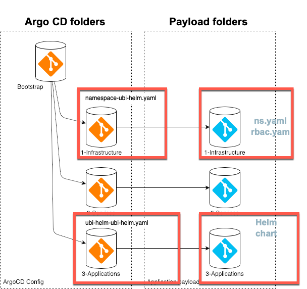

# Terraform GitOps UBI module

| Verify  |  Metadata   |
|--- | --- |
|||

## 1. Objective

This module is an example implementation for a `custom module`.

Therefor it just deploys a pure [UBI image](https://catalog.redhat.com/software/containers/ubi8/ubi/5c359854d70cc534b3a3784e) (`Red Hat Universal Base Image`) as a container with [Helm](https://helm.sh/). 

The UBI helm-chart example is based on the [ubi-helm repository](https://github.com/ibm/ubi-helm). That repository contains the starting point for the [values.yaml](https://github.com/ibm/ubi-helm/blob/main/charts/ubi-helm/values.yaml) in the Helm chart.

In the values file we can configure the [`replica count`](https://github.com/ibm/ubi-helm/blob/main/charts/ubi-helm/values.yaml#L6) of the pods. The deployed containers are only a basic UBI ([`Red Hat Universal Base Image`](https://catalog.redhat.com/software/containers/ubi8/ubi/5c359854d70cc534b3a3784e) ) with a linux operating system.

The helm chart implementation of that module you can find in the folder [`chart/ubi-helm`](https://github.com/cloud-native-toolkit/terraform-gitops-ubi/tree/main/chart/ubi-helm). 

> Note: That folder will be copied to the payload directory of your GitOps bootstrap configuration.

The example was expanded to provide following functionality: 

You can pass a command for the start up of the container with the module variable `command`. 

## 2. Example deployment

The following section shows an example deployment with the `terraform-gitops-ubi` module using GitOps.

We use the GitOps bootstrap configuration for ArgoCD provided be the [Technology Zone Accelerator Toolkit](https://modules.cloudnativetoolkit.dev/). For details you can visit the [terraform-tools-gitops](https://github.com/cloud-native-toolkit/terraform-tools-gitops) module.

During the deployment of the module create or update that GitOps repository that contains two folders. The following image shows the dependencies of the GitOps bootstrap configuration and the created files.



### GitOps in Argo CD

Here you see the deployment with GitOps.

* GitOps context ([app-of-apps](https://argo-cd.readthedocs.io/en/stable/operator-manual/cluster-bootstrapping/))


* UBI application deployment


### Access a running UBI container in OpenShift


* Access the UBI container from local machine

```sh
export PROJECT_NAME=ubi-helm
export CHART_NAME=ubi-helm
oc get pods
POD=$(oc get -n $PROJECT_NAME pods | grep $CHART_NAME | head -n 1 | awk '{print $1;}')
oc exec -n $PROJECT_NAME $POD --container $CHART_NAME -- ls
```

## 3. Software dependencies

The module depends on the following software components:

### Command-line tools

- terraform - > v0.15

### Terraform providers

None

## 4. Example usage

Below you can see the possible input variables.

```hcl-terraform
module "terraform-gitops-ubi" {
   source = "github.com/cloud-native-toolkit/terraform-gitops-ubi.git"
   
   gitops_config = module.gitops.gitops_config
   git_credentials = module.gitops.git_credentials
   server_name = module.gitops.server_name
   namespace = module.gitops_namespace.name
   kubeseal_cert = module.gitops.sealed_secrets_cert
   command = "echo 'hello world'"
}
```

