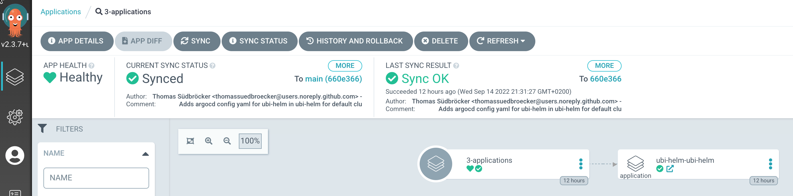
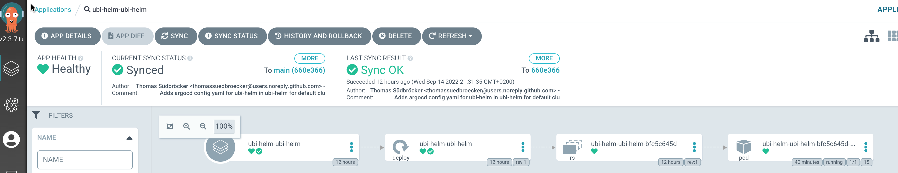
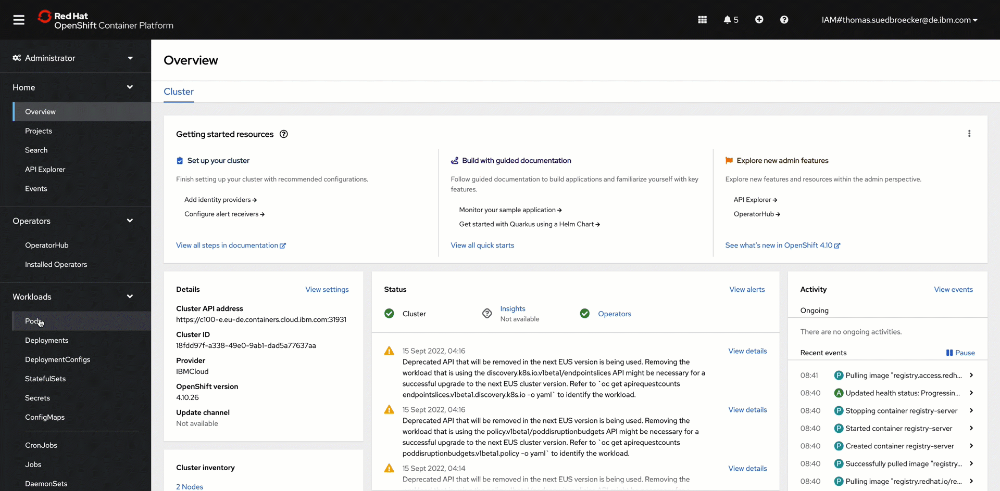

# Terraform GitOps UBI module

## 1. Objective

This module is an example implementation for a `custom module`.

Therefor it just deploys a pure [ubi image](https://catalog.redhat.com/software/containers/ubi8/ubi/5c359854d70cc534b3a3784e) (`Red Hat Universal Base Image`) as a container with [Helm](https://helm.sh/). With the [values.yaml](https://github.com/thomassuedbroecker/ubi-helm/blob/main/charts/ubi-helm/values.yaml) in the Helm chart we can configure [`replica count`](https://github.com/thomassuedbroecker/ubi-helm/blob/main/charts/ubi-helm/values.yaml#L6) of the pods. The deployed containers are only a basic ubi operating system.

The ubi helm-chart example based on the [ubi-helm repository](https://github.com/thomassuedbroecker/ubi-helm).

## 2. Example deployment

The following section shows an deployment with the `terraform-gitops-ubi` module using GitOps.

### GitOps in Argo CD

* GitOps context (app-of-apps)



* Application deployment



### Access a running UBI container in OpenShift



## 3. Software dependencies

The module depends on the following software components:

### Command-line tools

- terraform - > v0.15

### Terraform providers

None

## 4. Example usage

```hcl-terraform
module "terraform-gitops-ubi" {
   source = "TBD/terraform-gitops-ubi.git"
   
   gitops_config = module.gitops.gitops_config
   git_credentials = module.gitops.git_credentials
   server_name = module.gitops.server_name
   namespace = module.gitops_namespace.name
   kubeseal_cert = module.gitops.sealed_secrets_cert
}
```
